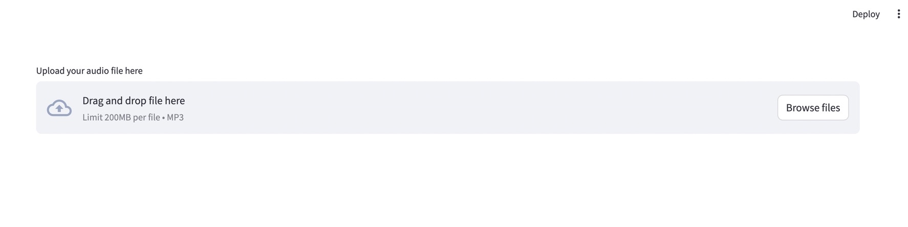
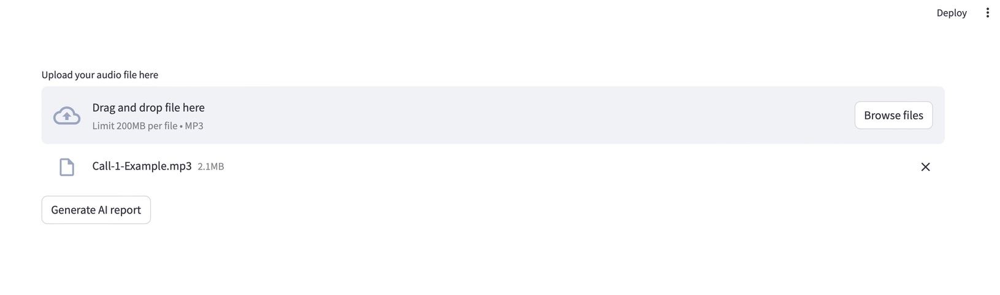
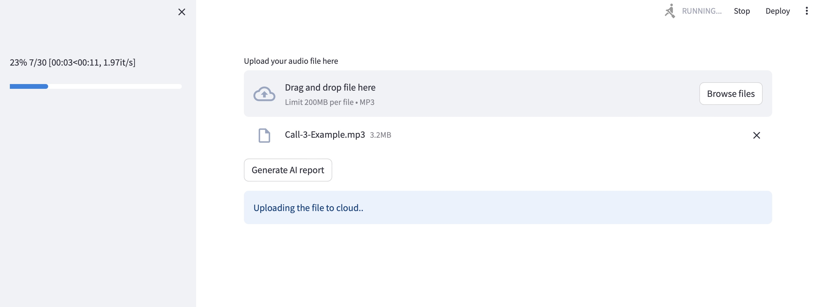
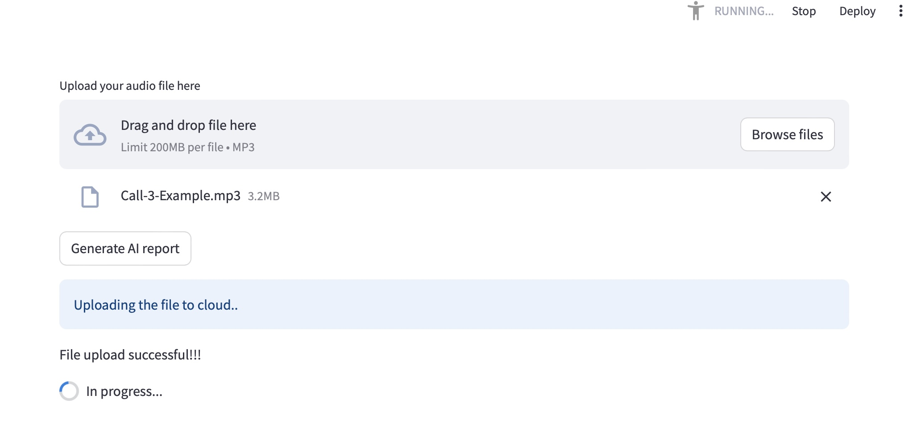
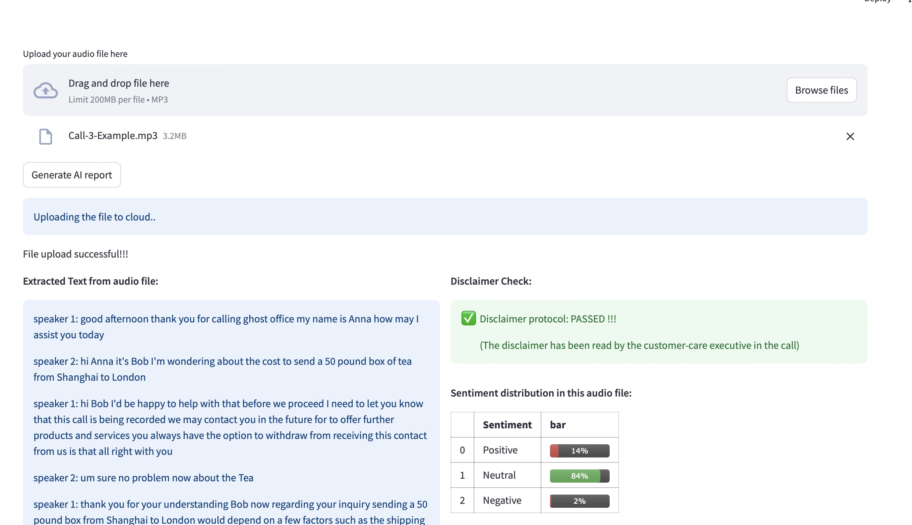
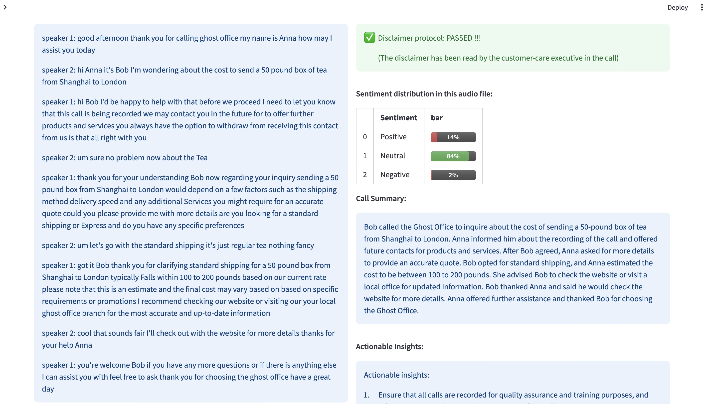

# Koodoo AI Call Center
### Installation guide

Create a seperate environment just in case to avoid any conflicts with other packages already installed in your system

##### Steps to create a seperate conda environment
The below command creates a new environment with python3.10 installed in it. 
Feel free to change the "env_name" to any custom name of your choice

>conda create -n env_name python=3.10

Activate the environment by executing the following command

> conda activate env_name

##### pip installation of the python package

1. Open the folder containing the python package

2. Go to terminal and run the requirements.txt file
   
3. The above code will install all the dependencies and install the entire package and its backend code in your system

### Project structure

Below is the overall project structure under the folder name Koodoo-AI-Call-Center
```bash

Koodoo-AI-Call-Center
   ├── build
   ├── dist
   ├── main.py
   ├── sentiment.py
   ├── transcribe.py
   ├── disclaimer_check.py
   ├── summarization.py
   ├── insights.py 
   ├── README.md
   └── requirements.txt
```

- build        :  contains the os specific build files and libraries
- dist         :  contains distribution and wheel files for python package built 
- main.py      :  core package control flow with streamlit app 
- sentiment.py :  script to analyse the sentiment
- transcribe.py:  script to convert audio to text 
- disclaimer_check.py: script to check inclusion of disclaimer script in conversation
- summarization.py: script to generate summary of the audio conversation
- insights.py  :  script to generate insights from the audio conversation
- README.md    :  file with instructions and guidance to use the module
- setup.py     :  file that contains commands to build the python package
- requirements :  contains all the python package dependencies required for the module
- constants.py : contains all the constant literal values and also the variable names which does not need to be changed

### Sample execution

The installation guide above has reached till the point of setting up environment and having this python package installed.
Now below we will see, how to run the package with some example codes

> streamlit run ./main.py

The above code should be executed from the terminal, which then runs the entire code base 
with the streamlit app hosted on local and remote server. 

#### Sample execution
The application start page looks like the below shown image

>

The above image clearly shows the feature of upload area for the user to upload a mp3 file

>

A random input mp3 file is selected, to show this demonstration

>

Click on the "Generate AI report button" to trigger the process. The first process is
to upload the file to the cloud. A progress bar shows the status of the upload process.

>

Once the upload is complete, the report generation starts after the success message!
The process runs and then the results are shown for 
1. Transcription of audio
2. Disclaimer check
3. Sentiment analysis
4. Actionable insights

>
> 
>